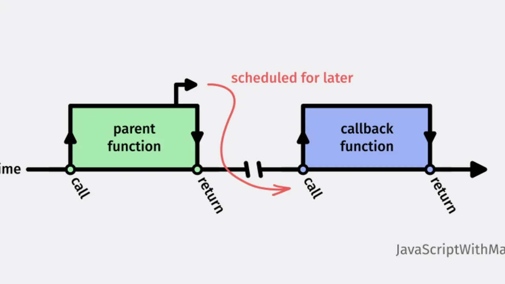

# Callbacks

## What is a Callback?

In JavaScript, **functions are first-class objects**. That means you can do almost anything with a function that you can do with other elements, like numbers, strings, etc. You can pass functions as arguments to other functions, return them from other functions, and assign them to variables.

A callback function is a function that's passed as an argument to another function and is expected to execute at a certain time. The function that takes the function as an argument is often referred to as the higher-order function.

Let's take a look at a simple example:

```jsx
function greeting(name) {
    console.log('Hello ' + name);
}

function processUserInput(callback) {
    let name = prompt('Please enter your name.');
    callback(name);
}

processUserInput(greeting);

```

In the example above, the `greeting` function is a callback. We pass it to `processUserInput` as an argument. The `processUserInput` function then invokes or "calls back" the `greeting` function when it has finished gathering user input.



## Callbacks in the DOM

When you want to respond to events on your webpage like clicks, mouse movements, key presses, or page load events, you will use callback functions.

Event listeners are methods we set on DOM elements to listen for specific events (like a button being clicked). The function that gets executed when the event occurs is a callback function.

Let's consider a simple example where we want to respond to a button being clicked:

```jsx
let button = document.querySelector('button');

button.addEventListener('click', function() {
  console.log('Button was clicked!');
});
```

In this example, `addEventListener` is a method that takes two arguments: the type of the event to listen for as a string ('click'), and a callback function to execute when that event occurs. When you click the button on the page, the message 'Button was clicked!' is logged to the console. The function we passed to `addEventListener` is the callback that gets executed when the 'click' event fires.

## Callbacks and Asynchronous Programming

Callbacks are heavily used in JavaScript for asynchronous programming. This is where an operation that takes some time to complete is initiated, but instead of waiting for it to finish, the rest of the code continues to run. When the operation is done, the callback function is called, or "called back."

A classic example is the `setTimeout` function:

```jsx
console.log('Hello');

setTimeout(function() {
    console.log('World');
}, 2000);

console.log('Goodbye');

```

In the example above, 'Hello' and 'Goodbye' are logged to the console immediately. However, 'World' is logged after 2 seconds, due to the `setTimeout` function. This function takes a callback function as its first parameter and a delay (in milliseconds) as its second parameter.
