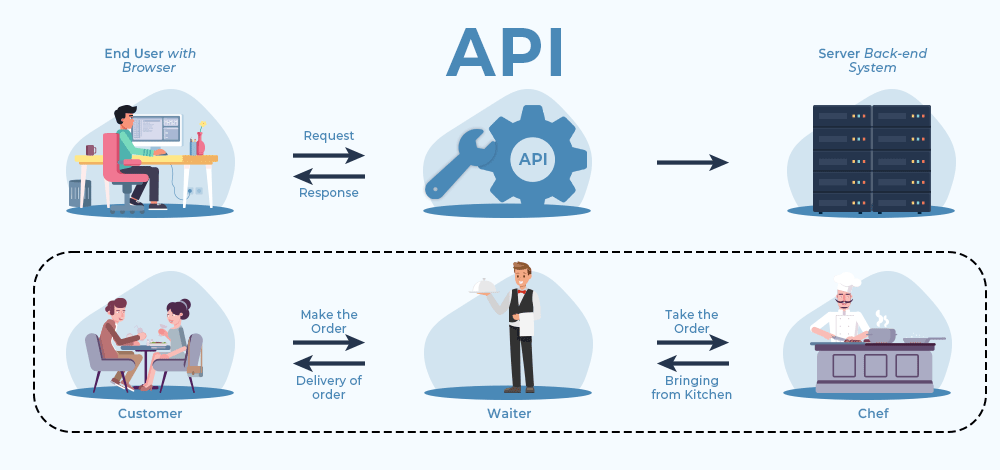
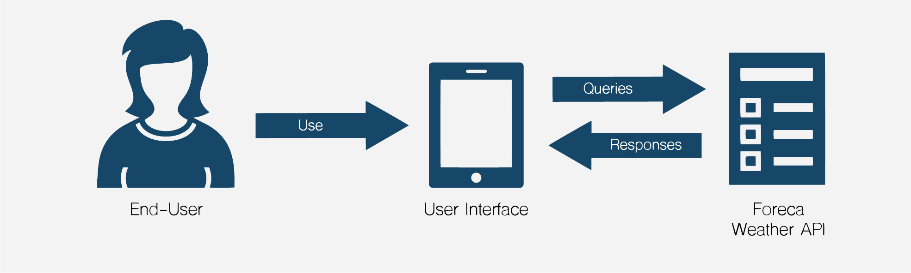

# Calling APIs

Having a strong understanding of asynchronous programming in JavaScript is foundational to successfully making API calls. The `fetch` API, which you may have used before, is a perfect example of an asynchronous operation. This time, we are going to explore in detail how it works and what does it do.

## What is an API?

In the context of web development, an API is essentially a set of rules and protocols that **define how software applications should interact with each other**. APIs allow us to use functions and data from other applications without needing to understand their underlying codebase.



For instance, a weather app on your phone might use the API of a weather service provider to fetch the latest weather information. The API defines the way that the weather app should make requests to the weather service and how the data will be structured in the response.



## Making API Calls in JavaScript

JavaScript provides several ways to interact with APIs and fetch data, such as using the `fetch` API, XMLHttp requests, or libraries like Axios. But for simplicity, we'll focus on the `fetch` API (this is provided by the browser)

The fetch API is built into most modern browsers and provides a powerful, flexible method for fetching resources asynchronously across the network. The `fetch()` method returns a Promise that resolves to the Response object representing the response to the request.

```jsx
fetch("<http://api.com>")
  .then(response => response.json())
  .then(data => console.log(data))
  .catch(error => console.error('Error:', error));
```

In this example, `fetch()` takes an API URL as an argument and returns a Promise, which fulfills with a Response object once the server responds.

The `then()` method is then used to handle this Promise. The first `then()` block is used to convert the response to a JSON format (which also returns a Promise), and the second `then()` block is used to handle the resulting data.

If there is an error at any point in the process, the `catch()` block catches the error and executes a function to handle it.

## API call with Async/Await

Although Promises significantly improve the handling of asynchronous operations compared to callbacks, they can still lead to complex code structures when dealing with a series of asynchronous operations. Here is where async/await syntax comes to the rescue, offering a more synchronous-looking way to handle Promises.

Let's look at how we can re-write the previous fetch example using async/await.

```jsx
async function fetchData() {
  try {
    const response = await fetch("<http://api.com>");
    const data = await response.json();
    console.log(data);
  } catch (error) {
    console.error('Error:', error);
  }
}

fetchData();
```

In this example, the function `fetchData()` is declared as `async`, which means it will always return a Promise. Inside this function, we use the `await` keyword to pause the execution of the function until the Promise is resolved or rejected.

The `try/catch` block is used to handle any errors that might occur during the fetch operation or while converting the response to JSON.
