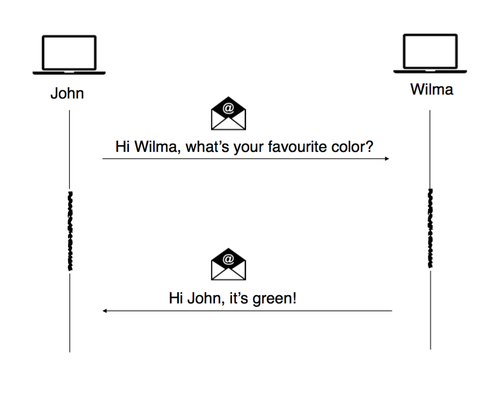
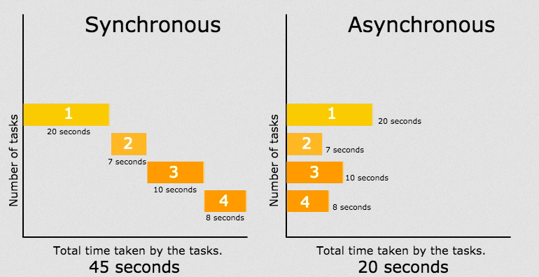

# Intro to Asynchronous Programming

Asynchronous programming is a critical aspect of modern JavaScript development, especially within the context of web development.

Do you remember using event listeners?

```jsx
document.addEventListener("click", () => { console.log ("hello") })
```

Or maybe you've done a API request using fetch:

```jsx
fetch("http://api.com").then(() => { console.log("my results") } )
```

If yes, you've done some asynchronous programming. But what is it exactly?

## What Does Asynchronous Mean?

To further understand the concept of asynchronous programming, let's draw a comparison to real-life conversations. Consider **two types of conversation**: `synchronous` (like a phone call or face-to-face conversation) and `asynchronous` (like an email exchange).

### Synchronous Conversations (Blocking)

In a synchronous conversation, like talking directly to someone, the process is blocking, i.e., you speak, then you wait and listen until the other person responds. While you're waiting for the response, **you don't do anything else - you're blocked**. 


This would be analogous to synchronous programming, where the execution is halted until the ongoing operation is completed.

### Asynchronous Conversations (Non-Blocking)

Now, consider an asynchronous conversation such as an email exchange. You send an email and then carry on with your other tasks without waiting for a response immediately. When a response arrives, you handle it, but in the meantime, **you're free to do other things.** 



This mirrors asynchronous programming: you kick off an operation, and rather than waiting for it to complete, you go on and execute other pieces of code. Once the result of the operation is ready, you handle it (usually using a callback, promise, or async/await in JavaScript), but you don't waste time just waiting.

This ability to overlap processing times for different tasks is what makes asynchronous programming so powerful and efficient, particularly in scenarios where tasks involve waiting for some external process — such as a server response, user input, or a file read operation — to complete.

## What is Asynchronous Programming?

Let's take an example, like clicking a button.

Imagine if you declare an event listener on click and you just held the button clicked. Should all the other operations in the program should stop?

Maybe a better idea is: When the operation is complete, your program is informed and given access to the result (if any).

## Why Asynchronous Programming?

Consider a typical web application. It might need to request data from a server, read files from the disk, and respond to user interactions, **all nearly simultaneously!**

In a synchronous programming model, the JavaScript engine would execute one operation at a time, in the exact order they appear in the code. So, if a function needs to fetch some data from a server (an operation that can take a few seconds or even minutes), the entire application would stop and wait for this operation to complete before moving on to the next one. This would lead to a terrible user experience, as the application becomes unresponsive.

Asynchronous programming, on the other hand, allows the JavaScript engine to execute other tasks while waiting for long-running operations to complete. It keeps your application responsive and efficient.



## How Does Asynchronous Programming Work in JavaScript?

**JavaScript is single-threaded**, which means it can handle one operation at a time.

Here is where the asynchronous nature comes in handy: JavaScript uses a mechanism called the event loop, which allows it to offload operations to the system kernel whenever possible.

When JavaScript encounters an asynchronous operation, like a network request, it sends this operation out to be handled by the program and continues to execute the rest of the code. Once the program finishes the operation, it sends a signal to JavaScript, which then runs a specified [callback function](https://developer.mozilla.org/en-US/docs/Glossary/Callback_function) to handle the result.

## Asynchronous Programming in the Wild

As mentioned above, you've likely used asynchronous programming already if you've used the `fetch` API or any function that returns a Promise. Other asynchronous operations include `setTimeout`, `setInterval`, browser APIs (audio, video, geolocation) and many more.

In the following articles, we'll dive deeper into these topics and learn more about callbacks, Promises, async/await syntax, and how to handle asynchronous operations effectively in your code.
