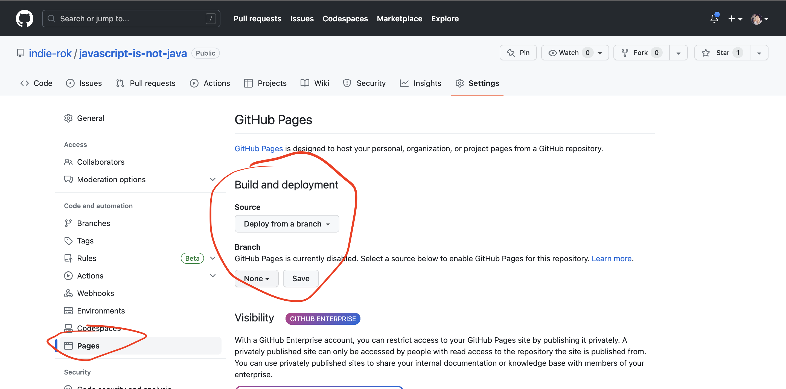

# Gh pages deploy

While developing your applications, it's crucial to have a reliable and accessible way to share your projects with the world. For static sites (composed of HTML, CSS, and JS), one great option is GitHub Pages. 

This article will guide you through the process of deploying your static website to GitHub Pages.

## Step 1: Create a GitHub Repository

First, you'll need a GitHub repository to host your website's files. If you haven't done so already, create a new repository on GitHub. You can name it anything you like, but keep in mind that the repository name will be in the URL of your hosted site.

## Step 2: Upload Your Website's Files

Once you have a repository, upload your website's files to it. You can do this by either cloning the repository to your local machine and pushing the files or by uploading the files directly on GitHub. Your repository should now contain at least one HTML file (usually `index.html`), along with any CSS and JavaScript files your website requires.

## Step 3: Configure GitHub Pages

Now, it's time to set up GitHub Pages for your repository:

1. Go to your repository on GitHub.
2. Click on the "Settings" tab.
3. Scroll down to the **"Pages"** section.
4. In the "Source" dropdown, select the branch that contains your website's files. This is usually the `master` or `main` branch.
5. Click "Save."

GitHub will now publish your website and display a link to it in the GitHub Pages section.

## Step 4: Access Your Website

Your website is now live! Click on the link provided in the GitHub Pages section of your repository's settings. It should look something like `https://<your-username>.github.io/<repository-name>/`.

You can share this link with anyone you want to access your website. Any changes you push to the selected branch will automatically be reflected on the live site.