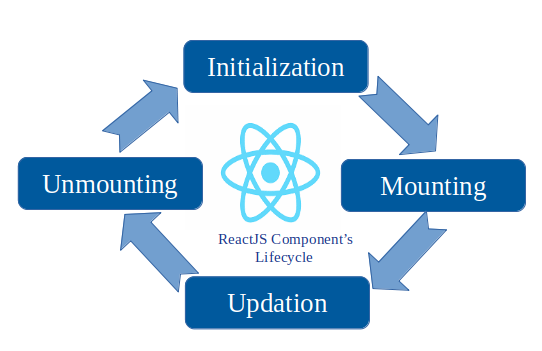

# Introduction to Component Lifecycle

React is a powerful JavaScript library for building user interfaces. One of the most important concepts in React is the component lifecycle.

In React, each component has several "lifecycle methods" that you can override to run code at particular times in the process.

## What is a Component Lifecycle?

In React, a component lifecycle can be defined as the series of methods that are invoked in different stages of the component's existence. The lifecycle can be broadly classified into three parts:

1. Mounting (Birth of your component)
2. Updating (Growth of your component)
3. Unmounting (Death of your component)



## Adding a Lifecycle Method to a Component

Open the previous project you created.  We will add some code to the `App.js` so it looks like this:

```jsx

import React, { useEffect } from 'react';

function App() {

    useEffect(() => {
      console.log("I mounted")
    }, []);

  return <h1>Hello, world!</h1>;
}

export default App;
```

Now run the project in your browser and open the console. You will notice a log that says `I mounted`, that is because using the `useEffect` hook, we are adding the capability to our component to access the lifecycle and do operations before, during, or after it is created.

We will explore more about these new methods in future lessons.

## Why Do We Need Lifecycle Methods?

Lifecycle methods are critical for managing what happens before a component is created, while it is active, and when it is destroyed. They help manage resources efficiently, initializing resources on mount, updating them when necessary, and cleaning up on unmount.

For example, if your component involves a real-time data subscription, you would start the subscription in `mounting` and close it in `unmounting` to prevent memory leaks.