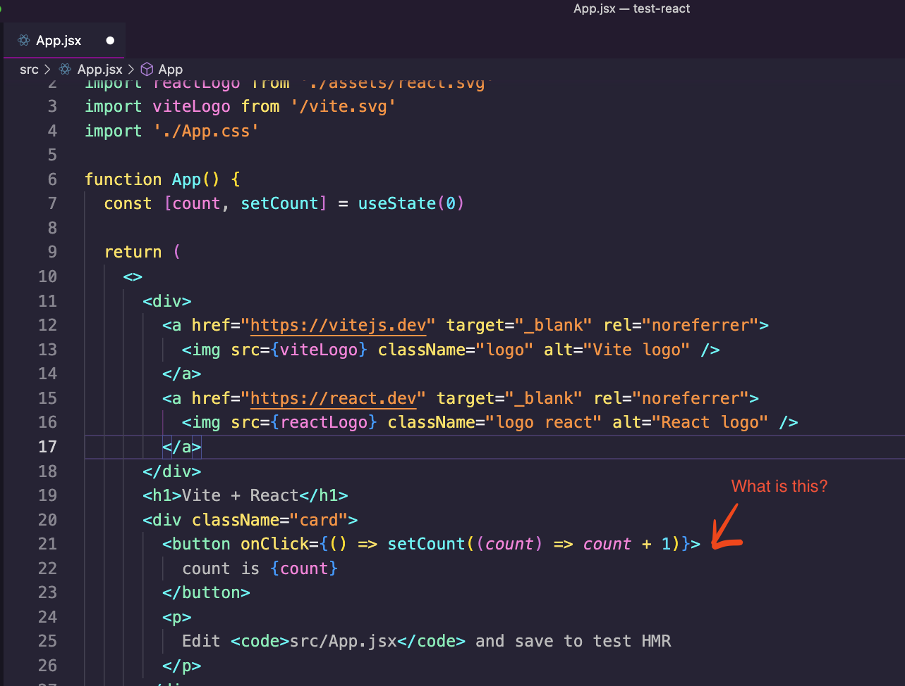

# Our First Component

Now, from the generated project, open the file App.jsx. It should look like this:

Most of this code looks like HTML inside of a JavaScript function. But also look at line 21, they are mixing JS code (a JavaScript function) with HTML attribute.

How is this possible?

It's all done with `JSX`, a new file type we will learn about