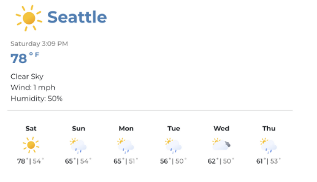

# Project: Weather Dashboard

## Project Set-up

Grab your starting code and link [here](https://classroom.github.com/a/g-VhoJds)

## Project Description

In this project, you will be building a **Weather Dashboard** using React.

The dashboard will display the following:

- Current city.
- Current day and time.
- Current weather conditions in text format (e.g., Cloudy, Sunny, Rainy).
- Current humidity level.
- Weather forecast for the next few days. (If clicking on a specific day, **display an alert** will show more detailed info about this day's weather.)

You will be making use of various React concepts you've learned such as components, jsx, css, and events

## Learning Objectives

By the end of this project, students should be able to:

1. Understand how to structure a React application.
2. Understand how to write your first components using JSX.
3. Understanding how to mix CSS and React.

## Project Example

## Milestones

### Milestone 1: Project Setup

Explore the folder we provide you with the boilerplate code, install dependencies, and run the project (in the local host)

### Milestone 2: Create Static Components

Create the static version of the app.

It should contain the following  components:

`CityName`, `CurrentDay`, `CurrentTime`, `WeatherCondition`, `HumidityLevel`, `ForecastNextWeek` . 

This info is static on should not change.

### Milestone 3: Add CSS

Finally, add some styles using your preferred method.
