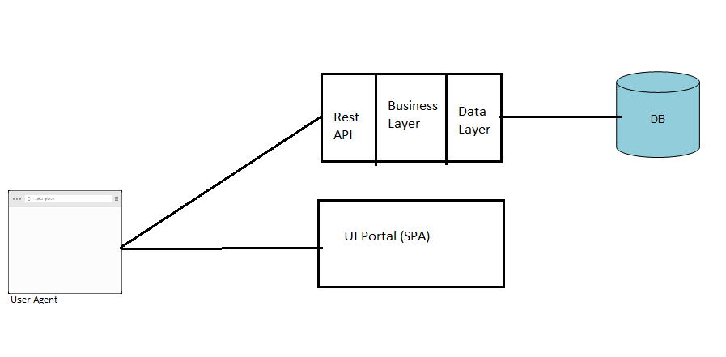

# What is a SPA

## What is a Single-Page Application (SPA)?

In the world of web development, a Single Page Application (SPA) is a type of web application that fits on a single web page. All your necessary code (HTML, JavaScript, and CSS) is retrieved with a single page load, or the appropriate resources are dynamically loaded and added to the page as necessary, usually in response to user actions.

The goal of a SPA is to provide a user experience that's similar to a desktop application. In a SPA, all the necessary code for the page is loaded only once and its display is updated dynamically, meaning that the page doesn't need to reload when the user interacts with it. This leads to a more fluid and faster experience for the user.

Here is a video to give a wider understanding:

[https://www.youtube.com/watch?v=ZEpfiGu1f8g&t=20s](https://www.youtube.com/watch?v=ZEpfiGu1f8g&t=20s)

## How does a SPA work?

Traditional web pages require reloading the entire page to fetch new content. This was not only inefficient but also resulted in a clunky and less-than-optimal user experience. In a SPA, only the necessary content is updated.

When a user clicks on a link or interacts with the site, JavaScript will intercept that interaction and prevent the browser from reloading the page. Then, it fetches the necessary data (typically in JSON format) via [Ajax](https://www.youtube.com/watch?v=3l13qGLTgNw) calls to the server. The new data is then used to update the web page dynamically.

The beauty of this approach is that only the part of the page that needs to change is updated, resulting in less data being transferred and providing a smoother and faster experience for the user.

### SPA and React

Very simple, React will help us to build SPA applications. Is a library that will give us tools to build SPAs in a very easy and pragmatic way.

## Examples of Single-Page Applications

You probably use SPAs every day without even realizing it! Gmail, Google Maps, Facebook, and Twitter are all examples of popular SPAs.

To summarize, SPAs are a great choice for developing modern, user-friendly web applications. However, they also present their own unique set of challenges. Understanding these benefits and challenges will help you decide when to use a SPA and how to overcome potential obstacles in your projects.

React, Angular, and Vue.js are currently the most popular JavaScript frameworks for building SPAs. As you continue to learn more about web development, you'll undoubtedly gain hands-on experience with these technologies and the SPA architecture.
