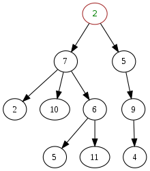
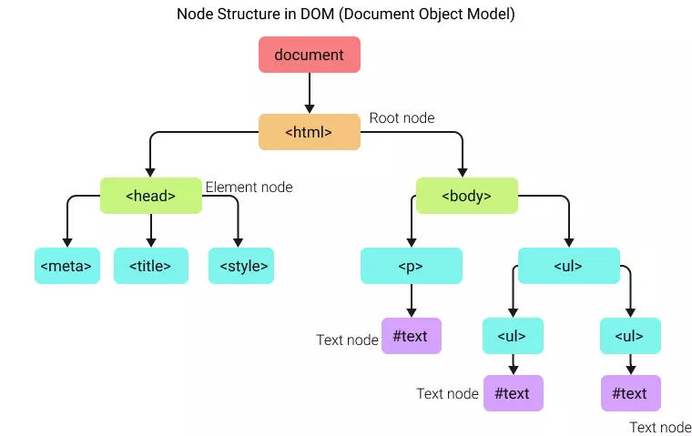

# What is the DOM?

If you've ever built a web page or used JavaScript to create dynamic, interactive web content, you've likely encountered the Document Object Model (DOM). Understanding the DOM is crucial for anyone looking to harness the full power of JavaScript in their web applications.

The Document Object Model (DOM) is a programming interface for HTML and XML documents. It represents the structure of a document and enables programming languages to manipulate the content and structure of a web document.

In essence, the DOM transforms your HTML document into an object-oriented tree structure with elements such as `<body>`, `<header>`, `<div>`, and `<p>` becoming nodes on the tree. This tree-like structure is often referred to as the "DOM Tree".

## The Structure of the DOM

The DOM represents an HTML or XML document as a logical tree structure, with each element, attribute, and piece of text in the document becoming a node in this tree. 



At the top of this tree is the `Document` node. From here, the structure follows the nesting of the markup, with child nodes stemming from their corresponding parent elements.

For example, the DOM representation of the following HTML code:

```html
<!DOCTYPE html>
<html>
    <head>
        <title>My First Web Page</title>
    </head>
    <body>
        <h1>Hello, World!</h1>
        <p>Welcome to my first web page.</p>
    </body>
</html>
```

would look something like this:

```ascii
Document
    |
    |- DOCTYPE: html
    |- html
        |
        |- head
        |   |
        |   |- title
        |       |
        |       |- #text: My First Web Page
        |
        |- body
            |
            |- h1
            |   |
            |   |- #text: Hello, World!
            |
            |- p
                |
                |- #text: Welcome to my first web page.

```

Or visually:



## Working with the DOM

Web browsers create the DOM automatically upon loading a web page, and JavaScript (or other scripting languages) can interact with the DOM to dynamically change the document's structure, style, and content.

Some common tasks include:

- **Changing the content of HTML elements:** You can select any HTML element and change its content using JavaScript.
- **Adding and deleting HTML elements:** You can create new elements, append them to existing elements, or remove existing elements and attributes.
- **Changing CSS styles:** You can select HTML elements and modify their CSS styles.
- **Reacting to HTML events:** You can assign functions to event handlers on HTML elements, allowing your JavaScript code to react to user interactions like clicks, mouse movements, keyboard input, and more.

For example, to change the text of the first `<p>` element in the document, you could use the following JavaScript code:

```jsx
document.querySelector('p').textContent = 'New text for the first paragraph.';
```

---

If you need, [this video](https://www.youtube.com/watch?v=y17RuWkWdn8), explains incredibly well what is the dom and how to query it.