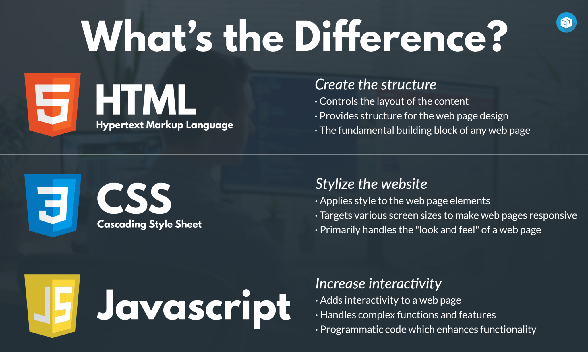

# Introduction

Let's start by distinguishing between these three languages, how they look like, and what they do.

## What are HTML, CSS, and JS?

So in summary:

- HTML gives structure to a website. (like what would be the order of an element)
- CSS makes it pretty (like the color of my elements)
- JS makes it interactive (what happens if I click a button)

## Why Learn JavaScript?

Although this course is focused on web applications, many of the principles can be used for other platforms. JavaScript is a very powerful programming language that, with the right tools, could allow you to create [mobile apps](https://reactnative.dev/), [desktop apps](https://www.electronjs.org/es/), [program robots](https://www.bouvet.no/bouvet-deler/utbrudd/learning-javascript-and-arduino-programming-with-johnny-five) or [create powerful back ends](https://expressjs.com/). 

Not to mention it's [one of the most](https://www.devjobsscanner.com/blog/top-8-most-demanded-languages-in-2022/) demanded programming languages for professional job opportunities and it's easy-to-learn syntax, it was the obvious choice when choosing a programming language for writing web applications. Even with interesting alternatives like [Dart](https://dart.dev/) or [Web Assembly](https://webassembly.org/), JavaScript is still the number one choice for everything related to front end programming.

## Can I Use My Python knowledge in JavaScript

Yes, in the next lessons, we will cover the basics of javascript, but keep the following page bookmarked, because many of the concepts we will see, probably you've already seen while learning Python.

### 1. Data Types (primitives)

| Python Concept | Python Example | JavaScript Concept | JavaScript Example |
| --- | --- | --- | --- |
| Integer | x = 5 | Number | let x = 5; |
| Float | y = 3.14 | Number | let y = 3.14; |
| String | s = 'hello' | String | let s = 'hello'; |
| Boolean | b = True | Boolean | let b = true; |

### 2. Data operations

| Python Concept | Python Example | JavaScript Concept | JavaScript Example |
| --- | --- | --- | --- |
| Addition | result = x + y | Addition | let result = x + y; |
| Subtraction | result = x - y | Subtraction | let result = x - y; |
| Multiplication | result = x * y | Multiplication | let result = x * y; |
| Division | result = x / y | Division | let result = x / y; |

### 3. Variables

| Python Concept | Python Example | JavaScript Concept | JavaScript Example |
| --- | --- | --- | --- |
| Variable assignment | x = 10 | Variable assignment | let x = 10; |
| Constants | X = 10 | Constants | const X = 10; |

### 4. Conditionals

| Python Concept | Python Example | JavaScript Concept | JavaScript Example |
| --- | --- | --- | --- |
| If-else | if x > 0: print("Positive") | If-else | if (x > 0) { console.log("Positive"); } |
|  | else: print("Non-positive") |  | else { console.log("Non-positive"); } |

### 5. Loops

| Python Concept | Python Example | JavaScript Concept | JavaScript Example |
| --- | --- | --- | --- |
| For loop | for i in range(3): print(i) | For loop | for (let i = 0; i < 3; i++) { console.log(i); } |
| While loop | while x > 0: x -= 1 | While loop | while (x > 0) { x--; } |

### 6. Functions

| Python Concept | Python Example | JavaScript Concept | JavaScript Example |
| --- | --- | --- | --- |
| Function definition | def func(): return "Hello" | Function definition | function func() { return "Hello"; } |

### 7. Data structures (Array, objects)

| Python Concept | Python Example | JavaScript Concept | JavaScript Example |
| --- | --- | --- | --- |
| List (Array) | my_list = [1, 2, 3] | Array | let myArray = [1, 2, 3]; |
| Dictionary (Object) | my_dict = {"key": "value"} | Object | let myObject = {"key": "value"}; |
| List of Dictionaries | my_list = [{"key1": "value1"}, {"key2": "value2"}] | Array of Objects | let myArray = [{"key1": "value1"}, {"key2": "value2"}]; |

### 8. Built-in methods for strings

| Python Concept | Python Example | JavaScript Concept | JavaScript Example |
| --- | --- | --- | --- |
| String length | length = len(s) | String length | let length = s.length; |
| String concatenation | combined = s1 + s2 | String concatenation | let combined = s1 + s2; |
| String find | index = s.find('llo') | String indexOf | let index = s.indexOf('llo'); |

### 9. Built-in methods for arrays

| Python Concept | Python Example | JavaScript Concept | JavaScript Example |
| --- | --- | --- | --- |
| Append to array | my_list.append(4) | Push to array | myArray.push(4); |
| Remove from array | my_list.remove(2) | Splice from array | myArray.splice(myArray.indexOf(2), 1); |
| Array length | length = len(my_list) | Array length | let length = myArray.length; |
| Access array element | element = my_list[0] | Access array element | let element = myArray[0]; |
| Sort array | my_list.sort() | Sort array | myArray.sort(); |
| Reverse array | my_list.reverse() | Reverse array | myArray.reverse(); |

## Topics to Review

- [HTML (Web Foundations)](https://wf-2.vercel.app/web-foundations-july-2022/foundations/html-elements-and-attributes.html)
- [CSS  (Web Foundations)](https://wf-2.vercel.app/web-foundations-july-2022/foundations/css-selectors-and-properties.html)
- [Figma (Project Management & Design)](https://pm-and-design.vercel.app/lessons/ui-design-basics/introduction-to-Figma.html)
- [UI Design (Project Management & Design)](https://pm-and-design.vercel.app/lessons/ui-design-basics/basic-principles.html)
