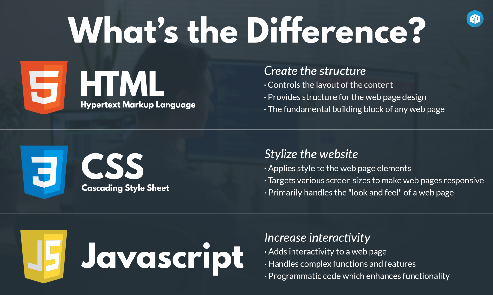

# What are HTML, CSS, and JS?

So in summary:

- HTML gives structure to a web site. (like what would be the order of an element)
- CSS makes it pretty (like what would it be color of my elements)
- JS makes it interactive (what happens if I click a button)