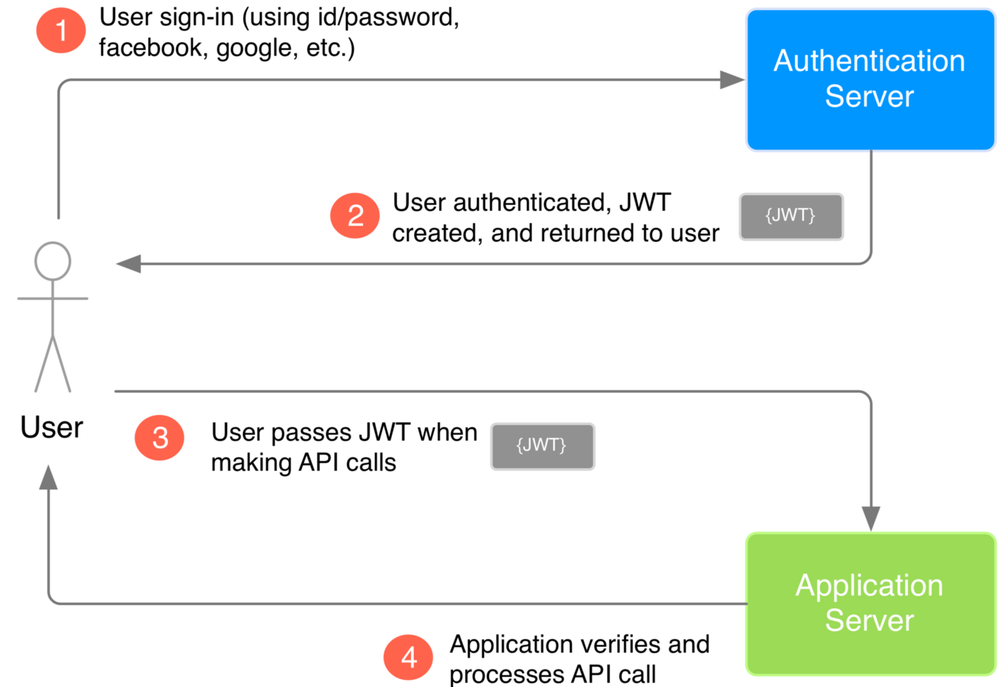

# What is jwt

Traditional server-rendered applications usually handle authentication through sessions. When a user logs in, the server creates a session, stores it on the server-side, and sends a cookie containing the session ID to the browser. For subsequent requests, the browser sends this cookie along, and the server validates it against the stored session information. This means server will remember who is making this request.

However, this approach has its drawbacks when it comes to Single Page Applications (SPAs) like those built with React. SPAs typically communicate with the server via APIs, which should be stateless (servers should  **NOT** remember who made requests) by design. They shouldn't maintain a server-side session for each user, but rather handle requests that come with all the information needed for processing.

That's where JSON Web Tokens (JWTs) come in.

## What is JWT?

[https://www.youtube.com/watch?v=7Q17ubqLfaM&t=768s](https://www.youtube.com/watch?v=7Q17ubqLfaM&t=768s)

A great video that explains JWT flow.

In a JWT-based authentication flow, the server generates a token that certifies the user's identity, and sends it to the client. The client then stores this token and includes it in all subsequent requests for validation.

It's just a encrypted string and it looks like this:

## Implementing Auth Flow in React with JWT

Here's a basic overview of how we can implement JWT-based authentication in a React app:

1. **User Login**: Capture user credentials and send them to the server.
2. **Token Generation**: If the credentials are valid, the server generates a JWT and returns it to the client.
3. **Token Storage**: Store the JWT on the client-side. This is typically done in either localStorage or in-memory, depending on your security needs.
4. **Protected Routes**: Protect certain routes by checking if a valid token exists before rendering them. If no valid token is found, redirect the user to the login page.
5. **Sending Tokens**: Include the token in the `Authorization` header when making requests to protected API endpoints.
6. **Token Verification and User Logout**: The server checks the validity of the JWT on receiving an API request. If the token is invalid or expired, return an error response, prompting the client to log in again.

After reci