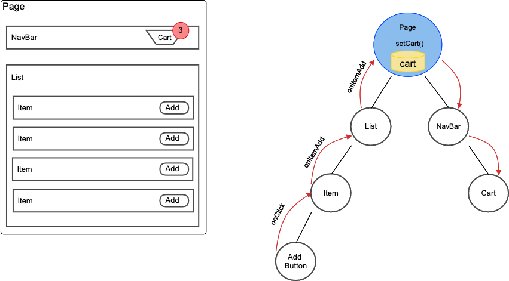
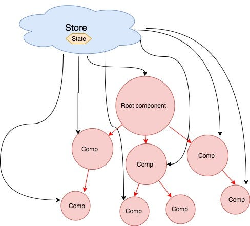

# Global state

While local component state is extremely useful, it doesn't solve every problem. State can be "lifted" up to parent components to be shared between children, but this can quickly become unwieldy. As applications grow larger and more complex, managing state can become harder.

In React, parent components communicate with child components through **`props`**. But what happens when a prop needs to be passed through multiple layers of components?

Consider a scenario where you have a deeply nested component structure. A top-level parent component might have some state that a child component several layers down needs access to. To get the state to this child component, you'd have to pass it down through all the intermediary components as a prop. This is known as **prop drilling**.

To avoid prop drilling, global state comes in. A global state is a state that can be accessed from any component in your app, regardless of the component's position in the tree. This is incredibly useful for things like user authentication data, theme preferences, or data fetched from an API.

Global state can be a source of complexity, as changes to global state can affect many parts of your application. Properly managing these changes to ensure a consistent user experience is one of the challenges of complex state management.

Global store diagram. All state is centralised in a store and components talk directly to store. This avoids prop drilling.