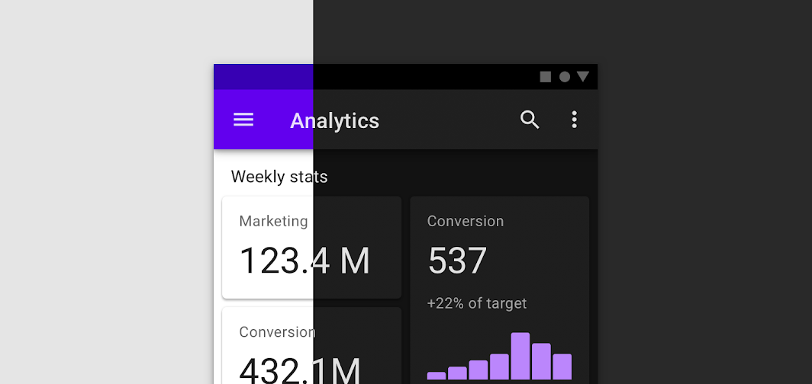

# React Context

React by default, comes with it's own library to handle global state, **React Context.**

## What is React Context?

React Context provides a mechanism to pass data through the component tree **without having to pass props manually at every level**. In other words, it is designed to share data that can be considered "global" for a tree of React components.

## Setting Up a Context with an exercise

Let's assume we an app that requires to have a theme, dark or light.



As some components will change color depending on the theme, we need to have this value, `dark or light`, **available through all the app.**

Whiteout global state, we would need to pass down this values regardless the level of component deepness. 

In order to avoid that, we can just set up a global state for this values, and just call the theme value when we need it. This is how it looks like, we are in `App.js`

```jsx
// App.js
import React, { useState } from 'react';

// Create a context and export it
export const ThemeContext = React.createContext();

// Create a provider component
export function App() {
  const [theme, setTheme] = useState('light');

	// Notice how OtherComponents dont pass down state with props
  return (
    <ThemeContext.Provider value={{ theme, setTheme }}>
			<ThemedButton />
    </ThemeContext.Provider>
  );
}

export default App;
```

In the example, first we need to create a context using `React.createContext()`. 

The `Provider` component is used higher in the tree and accepts a `value` prop. Any component below the provider in the tree can access this value.

Once it's set up, you can access to the theme, and setTheme values, every where in the app without passing down props.

## Using the Context

Any component in the tree can now access the theme. In a children component, `ThemedButton`, notice how the  `theme` and `setTheme` variables can be accessed with out passing down the values from `App.js`:

```jsx
import React, { useContext } from 'react';
import { ThemeContext } from './App';

function ThemedButton() {
  const { theme, setTheme } = useContext(ThemeContext);

  function toggleTheme() {
    setTheme(theme === 'light' ? 'dark' : 'light');
  }

  return (
    <button onClick={toggleTheme}>
      Switch to {theme === 'light' ? 'dark' : 'light'} mode
    </button>
  );
}

export default ThemedButton;

```

Here, we're using the `useContext` hook to access the `theme` and `setTheme` from the `ThemeContext`. When the button is clicked, the `toggleTheme` function is executed, toggling the theme between 'light' and 'dark'.