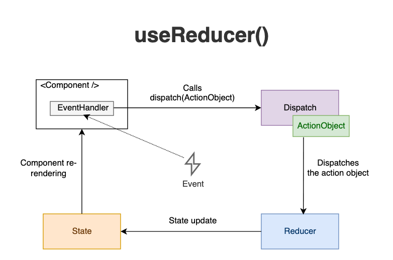

# useReducer

Managing state in a large application can become cumbersome. In particular, when state transitions become complex due to intertwined business logic, `useState` might not be the most efficient solution. In such cases, the `useReducer` hook provided by React can be an ideal solution.

## Reminder: What are Hooks?

React Hooks, are normal JS functions with superpowers. They let you use state and other React features without writing a class. `useState` and `useEffect` are the most commonly used hooks, allowing us to handle component state and side-effects respectively.

## Why do we need reducers?

We need reducers when we have multiple state that is connected. Take a form as an example.

```jsx
import React, { useState } from "react";

function RegistrationForm() {
  const [name, setName] = useState("");
  const [email, setEmail] = useState("");
  const [password, setPassword] = useState("");

  const handleSubmit = (event) => {
    event.preventDefault();
    // Handle form submission...
  };

  return (
    <form onSubmit={handleSubmit}>
      <input value={name} onChange={(e) => setName(e.target.value)} />
      <input value={email} onChange={(e) => setEmail(e.target.value)} />
      <input value={password} onChange={(e) => setPassword(e.target.value)}  />
      <button type="submit">Register</button>
    </form>
  );
}
```

If we add a few more fields, we will need a lot of `useState` making the code very hard to manage.

Now, this is how the problem would be solved with `useReducer`

```jsx
import React, { useReducer } from "react";

const initialState = { name: "", email: "", password: "" };

function reducer(state, action) {
  return {
    ...state,
    [action.name]: action.value,
  };
}

function RegistrationForm() {
  const [state, dispatch] = useReducer(reducer, initialState);

  const handleChange = (event) => {
    dispatch({
      name: event.target.name,
      value: event.target.value,
    });
  };

  const handleSubmit = (event) => {
    event.preventDefault();
    // Handle form submission...
  };

  return (
    <form onSubmit={handleSubmit}>
      <input name="name" value={state.name} onChange={handleChange} />
      <input name="email" value={state.email} onChange={handleChange} />
      <input name="password" value={state.password} onChange={handleChange} />
      <button type="submit">Register</button>
    </form>
  );
}
```

As you can see, there is not `useState` anymore, only **one** `useReducer`. 

Let's explore this hook in detail.

## What is a Reducer?

This video explains the whole concept and it's use cases:

[https://www.youtube.com/watch?v=kK_Wqx3RnHk&t=2s&ab_channel=WebDevSimplified](https://www.youtube.com/watch?v=kK_Wqx3RnHk&t=2s&ab_channel=WebDevSimplified)

So, in basic words. A reducer is a simple pure function that **takes an existing state and an action as input and returns a new state**.

```jsx
function reducer(state, action) {
  switch (action.type) {
    case 'INCREMENT':
      return state + 1;
    case 'DECREMENT':
      return state - 1;
    default:
      return state;
  }
}
```

The key characteristics of a reducer function include:

- **It does not mutate the existing state**. Instead, it produces a new state based on the input action.
- **It's deterministic**. Given the same state and action, it will always return the same result.
- **It handles every possible action**. If the action type doesn't match any of the cases in the reducer, it should return the existing state as a default.

Reducers are typically used with an **action**, which is an object that contains a `type` property and any additional data that might be necessary to compute the new state. For example:

```jsx
const action = {
  type: 'INCREMENT',
};
```

This is the full diagram on the useReducer architecture:



## Understanding useReducer

The `useReducer` hook is an alternative to `useState`. Accepting a reducer of type `(state, action) => newState` and returning the current state paired with a `dispatch` method, it helps us to manage complex state logic.

```jsx
const [state, dispatch] = useReducer(reducer, initialArg, init);
```

This hook is usually preferable over `useState` when you have complex state logic that involves multiple sub-values or when the next state depends on the previous one. (like a form with a lot of fields)

## useReducer Simple example

Let's consider an example where we want to manage the state of a counter. Our counter can be incremented, decremented, and reset to its initial value.

First, we define our initial state:

```jsx
const initialState = {count: 0};
```

Next, we define our reducer function. A reducer function accepts the current state and an action, and returns the new state:

```jsx
function reducer(state, action) {
  switch (action.type) {
    case 'increment':
      return {count: state.count + 1};
    case 'decrement':
      return {count: state.count - 1};
    case 'reset':
      return initialState;
    default:
      throw new Error();
  }
}

```

Now, we can use our reducer function in a component:

```jsx
import React, { useReducer } from 'react';

function Counter() {
  const [state, dispatch] = useReducer(reducer, initialState);

  return (
    <>
      Count: {state.count}
      <button onClick={() => dispatch({type: 'reset'})}>Reset</button>
      <button onClick={() => dispatch({type: 'increment'})}>+</button>
      <button onClick={() => dispatch({type: 'decrement'})}>-</button>
    </>
  );
}

export default Counter;

```

In this example, we dispatch actions when the buttons are clicked, and our reducer updates the state according to the received action.

In conclusion, `useReducer` provides a robust way to manage complex state in your components. It helps make state updates predictable and maintainable, which is particularly useful in larger applications with more state logic.