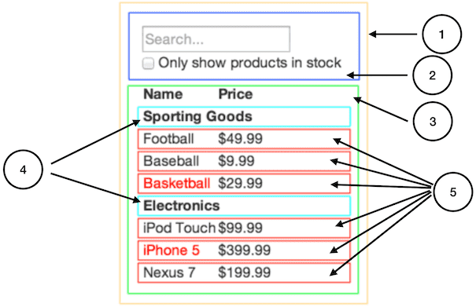
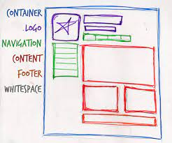

# How to Think in React

React is a popular JavaScript library for building user interfaces. The core philosophy of React revolves around the concept of Components. In this article, we'll dive deep into understanding components, their significance, how to create and reuse them, and more.

## What are Components?

Components are the building blocks of any React application. A component is a self-contained piece of code that manages its own structure, functionality, and render output. Each component in React is a JavaScript function that returns JSX (a syntax extension that allows you to write HTML in JavaScript).

Think of components as Lego blocks. Just as you can build various structures using different Lego pieces, you can build different UIs using different React components.



You’ll see here that we have five components in our app. We’ve italicized the data each component represents. The numbers in the image correspond to the numbers below.

1. **`FilterableProductTable` (orange):** contains the entirety of the example
2. **`SearchBar` (blue):** receives all *user input*
3. **`ProductTable` (green):** displays and filters the *data collection* based on *user input*
4. **`ProductCategoryRow` (turquoise):** displays a heading for each *category*
5. **`ProductRow` (red):** displays a row for each *product*

## Why Do We Need Components?

Components come with a variety of benefits that make them a crucial aspect of React. Here are a few reasons why we use components in React:

1. **Reusability:** Components can be reused, meaning you can create a component once and use it in multiple places without re-writing it.
2. **Simplicity:** UIs are easier to understand and manage when they are divided into components, with each responsible for a specific functionality.
3. **Efficiency:** Components render independently, meaning a change in one component doesn’t require a re-render of the entire page. This leads to a better user experience and improved performance.

## Creating and Using Components

To create a component in React, you define a new function that returns JSX. For example:

```jsx
function Welcome() {
  return <h1>Hello worl</h1>;
}

```

This function is a valid React component because it accepts a single "props" object argument with data and returns JSX. We can then reuse this component in another part of our code like so:

```jsx
function App(){
  return <div>
    <Welcome />
    <Welcome />
    <Welcome />
  </div>
}
```

## Real-World Examples of Components

Almost every website you interact with daily is built using some combination of components. For instance, a website may have a `Navbar` component for navigation, a `Footer` component for the website's footer, a `User` component to display user information, and so on.

Here is an example of how a news website could be broken down into components:

- `Navbar`: This component could include the logo and the navigation links.
- `NewsArticle`: This component could represent a single news article.
- `NewsFeed`: This component could use the `NewsArticle` component multiple times to create a list of news articles.
- `Sidebar`: This component could include information about the writer, popular articles, and other related information.
- `Footer`: This component would include links like 'About Us', 'Contact Us', etc.



When you visit a website, try to identify which parts of the website could be turned into reusable components. This exercise will help you get into the mindset of "thinking in React".

## Conclusion

Understanding the concept of components is a fundamental aspect of becoming proficient in React. They help you organize your UI code into manageable pieces that can be understood, reused, and tested independently. As you continue your journey with React, you'll find yourself thinking in components, breaking down complex UIs into simple, reusable parts. This is a key part of "thinking in React".
