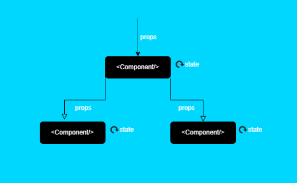

# Props

In React, props are a powerful feature that allow us to pass data from parent components to child components. This article will explore what props are, why we need them, and how to use them with functional components.

## What are Props?

In React, "props" is short for properties. They are the arguments passed into React components, similar to function parameters in JavaScript. Props allow us to make our components more dynamic and reusable by passing data from parent components to child components.



Here is a simple example of how props can be used:

```jsx
function Greeting(props) {
  return <h1>Hello, {props.name}!</h1>;
}

function App() {
	return <div>
		<Greeting name="Emmanuel" />
		<Greeting name="Michael" />
		<Greeting name="Kodi" />
	</div>
}

/***
Displays in the browser
Hello, Emmanuel
Hello, Mochael
Hello, Kodi
/*
```

In this example, we define a `Greeting` component that accepts `props` as an argument. The component then uses the `props.name` property in its JSX. When we use the `Greeting` component, we pass a `name` prop to it, which then gets displayed in the browser. 

## Why Do We Need Props?

Props are fundamental to the concept of components in React. They allow us to:

1. **Pass data** from parent components to child components.
2. **Increase reusability** of components. With props, we can write a single component and then reuse it with different data.
3. **Improve readability** of our codebase. We can  know what a component does by just looking at the props name.

## How to Use Props in React Components

Let's dive into some more examples of how to use props in functional components.

### Passing Multiple Props

You can pass multiple props to a component:

```jsx
function Profile(props) {
  return (
    <div>
      <h1>{props.name}</h1>
      <p>{props.bio}</p>
    </div>
  );
}

function App() {
  return <Profile name="John Doe" bio="A web developer from New York." />
}

```

### Passing Arrays and Objects as Props

You can also pass complex JavaScript types like arrays or objects as props:

```jsx
function List(props) {
  const items = props.items.map((item, index) => <li key={index}>{item}</li>);
  return <ul>{items}</ul>;
}

function App() {
  return <List items={['Apple', 'Orange', 'Banana']} />
}
```

### Destructuring Props

To make your code cleaner, you can destructure the props in the function signature:

```jsx
function Greeting({ name }) {
  return <h1>Hello, {name}!</h1>;
}

function App() {
  return <Greeting name="World" />
}

```

This syntax can be particularly useful when you have many props.