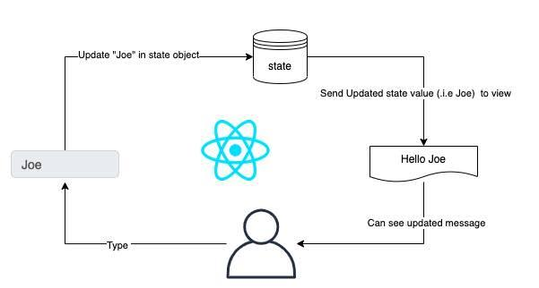

# State

React's state is one of the essential concepts you'll need to understand to build dynamic and interactive components in React. This article will explore what state is, why we need it, how it differs from props, and how to use the `useState` hook.

## What is State?

In React, state refers to the data that can change over time and affect the behavior or render output of a component. 

One analogy I like is to think about your emotional state. It will change over time. It's rarely stable.

In other words, it's the component's memory. The state in a React component is a JavaScript object and can hold information that may change over the lifetime of the component.

## Why Do We Need State?

Without state, our components would be static and only depend on the props given to them. With state, our components become interactive and dynamic. For instance, state allows us to:

- **Store user input**: We can use state to remember the text that a user types into a form field.

- **Toggle elements**: We can use state to decide whether or not to show certain elements, such as a dropdown menu.

- **Fetch and display data**: We can use state to store data fetched from an API and update the UI when the data arrives.

## Difference Between State and Props

Props and state in React are both plain JavaScript objects holding information that influences the output of render, but they serve different purposes:

1. **Props** are passed to the component (similar to function parameters) and are immutable (they don't change) within the component.
2. **State** is managed within the component (similar to variables declared within a function) and can be changed within the component.
